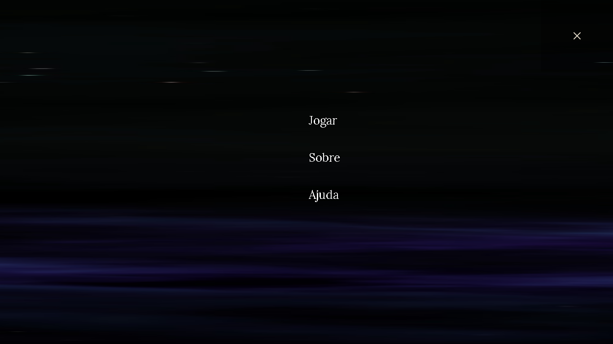
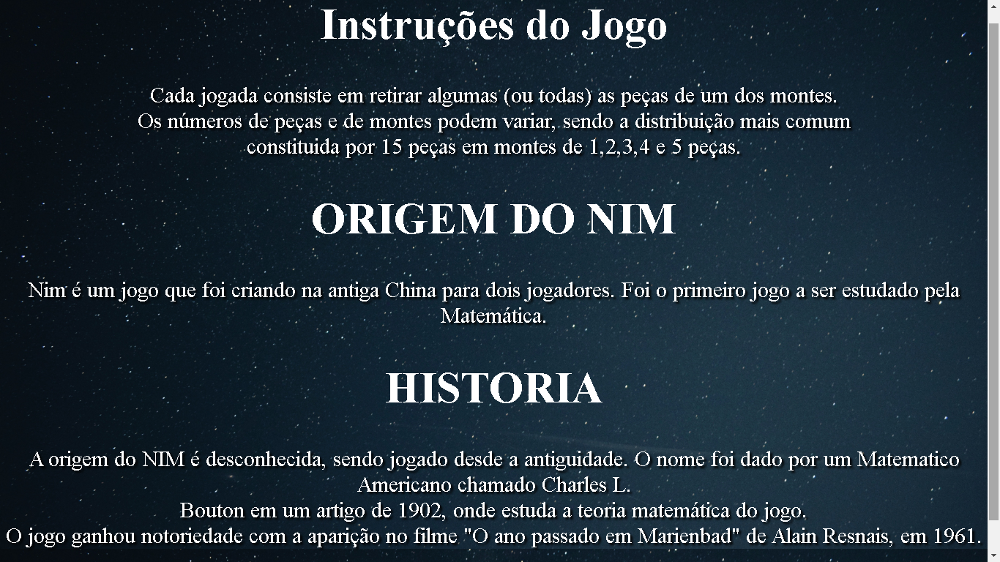
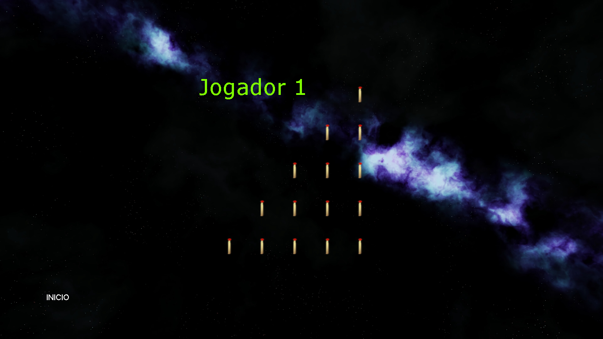

# jogo-nim

O jogo dispõe das seguintes regras:("Cada jogada consiste em retirar algumas (ou todas) peças de um dos montes. Os números de peças e de montes podem variar, sendo a distribuição mais comum constituida por 15 peças em montes de 1,2,3,4 e 5 peças.")

## Imagens do Game

